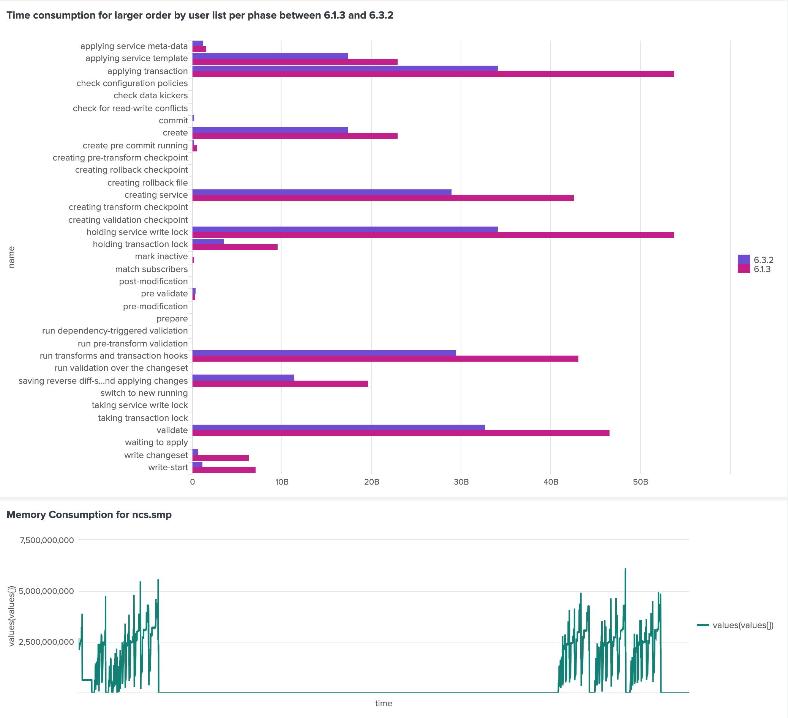

# Splunk NSO Integration Example - Native Install
This repository provide a Splunk integration setup example for NSO. 


# Dependency
opentelemetry-collector - https://github.com/open-telemetry/opentelemetry-collector/tree/main
This example is based on the example in the Splunk Exporter in opentelemetry-collector -  exporter/splunkhecexporter

# Requirment
* Python3.11 - Python3.12 will have issue when building setuptools. 
* python3.11-dev
* python3.11-distutils
* collectd - https://pminkov.github.io/blog/how-to-install-collectd-on-ubuntu.html  
Sample Command for Linux - Debian Kernal
```
sudo add-apt-repository ppa:deadsnakes/ppa
sudo apt update
sudo apt install python3.11
rm /usr/bin/python3
ln -s /usr/bin/python3.11 /usr/bin/python3
sudo apt-get install python3.11-dev python3.11-distutils
sudo apt-get install collectd
```

* Observability Exporter
	* Guide - https://developer.cisco.com/docs/nso/observability-exporter/
	* Download -https://software.cisco.com/download/home

* Splunk
	* Splunk Enterprise
		* Local Install - https://www.splunk.com/en_us/download/splunk-enterprise.html
		* Splunk Docker Container - https://hub.docker.com/r/splunk/splunk/
	* Splunk Cloud - https://www.splunk.com/en_us/products/splunk-cloud-platform.html

# Before Start
Modify the "token" and "endpoint" address in "run/otel-collector-config.yml" under various "exporters"
* endpoint address - Splunk address
* token - HEC token

The connection between NSO and HEC Collector is setup automatically.  
However, download the  observability-exporter than put the the observability-exporter inside nso/packages.
If you have any other package that want to run together with the example, please also copy to the same folder nso/packages. 

# Usage
Setup the enviorment
```
make deps
make clean all
```

Start up the repo(Collector + NSO) with the collector in the background
```
make start
```

Start up the repo(Collector + NSO) with the collector in the frontend
```
make start_frontend
```

Stop the repo(Collector + NSO)
```
make stop
```

Clean Up NSO enviorment
```
make clean
```


# Setup CollectD for NSO Process(ncs.smp) Monitoring
## CollectD Agent
* Install CollectD via the following command or run the collectd/install.sh via sudo
```
sudo apt-get install collectd
```
* Configure the CollectD in /etc/collectd/collectd.conf. Sample collectd.conf file can be found in collectd/collectd.conf. Detail can be found in Splunk Guide - https://docs.splunk.com/Documentation/AddOns/released/Linux/Configure
	* Configure processes section to lock down the process that is going to monitor as ncs.smp
	```
	LoadPlugin processes
	<Plugin processes>
        	Process "ncs.smp"
	</Plugin>
	```

	* Configure write_http to send the data to Splunk
	```
	LoadPlugin write_http
	<Plugin write_http>
        	<Node "splunk">
                	URL "http://<Splunk IP>:8088/services/collector/raw?channel=ebbdca9e-29c1-433b-9398-170b693cddd9"
                	Header "Authorization: Splunk ebbdca9e-29c1-433b-9398-170b693cddd9"
                	Format "JSON"
                	Metrics true
                	StoreRates true
        	</Node>
	</Plugin>

	```

	* Restart CollectD
	```
	systemctl restart collectd.service
	systemctl status collectd.service
	```

## Splunk Add-on for Linux and HEC 
* Download Splunk Add-on for Linux from Splunk Base(Login Required) - [Splunk Base](https://splunkbase.splunk.com/app/3412?_gl=1*k1hbge*_gcl_aw*R0NMLjE3MjI5NTk2MzMuQ2p3S0NBandrOGUxQmhBTEVpd0FjOE1IaVB5dXNqMFM0cWxkV1dlVkdkMk5uMXd3NUo0T3prWVNXX1pac3ExQUNCeU5tWkhtdWE2TVF4b0NqWUlRQXZEX0J3RQ..*_gcl_au*MTA3ODgwMTkxMC4xNzIwMTAzMjk5*FPAU*MTA3ODgwMTkxMC4xNzIwMTAzMjk5*_ga*Mjk4MjAwODMuMTcyMDEwMzI5OA..*_ga_5EPM2P39FV*MTcyMzExNjcwNy4xNS4xLjE3MjMxMTY3MDkuMC4wLjkwNjg5Mzg4NA../)
* Install Add-on by following the guide - https://docs.splunk.com/Documentation/AddOns/released/Overview/Singleserverinstall
* Configure the HEC input via the guide - https://docs.splunk.com/Documentation/AddOns/released/Linux/Configure2
	* as event - linux:collectd:http:json
	* as metrics - linux:collectd:http:metrics (Additional Config is required from the guide above)


# Good to Know
Before Push, reset everything
```
make reset
```

# What this Example do
* NSO side
	* Setup the NSO running directory in nso folder
	* When NSO startup, load the observerbility exporter config from nso/ncs-cdb/export_config.xml while 10.5.0.5 is the collector address and 4318 is the HTTP port ont the collector side
	```
	admin@ncs# unhide debug
	admin@ncs# show running-config progress 
	progress export enabled
	progress export otlp host 10.5.0.5
	progress export otlp port 4318
	progress export otlp transport http
	progress export otlp metrics host 10.5.0.5
	progress export otlp metrics port 4318

	```
* Collector Side
	* Pull the "contrib" version of opentelemetry-collector from opentelemetry-collector-contrib in run folder
	* Startup the collector with docker compose inside run directory
		* Docker Compose Settings - run/docker-compose.yml
		* Docker Container Settings - run/Dockerfile
		* Collector Settings - run/otel-collector-config.yml
			* Exporter Collector Settings - https://github.com/open-telemetry/opentelemetry-collector-contrib/tree/main/exporter/splunkhecexporter
			* Receiver Collector Settings - https://github.com/open-telemetry/opentelemetry-collector/blob/main/receiver/otlpreceiver/README.md
* CollectD
	* Manual setup is required based on the "Setup CollectD for NSO Process(ncs.smp) Monitoring" chapter above. However example config file and installation script is provided

# Overview Diagram	
```
┌─────────────────┐                    ┌────────┬─────────────────┌────────┐                         ┌─────────────────┐
│                 │                    │        │                 │        │                         │                 │
│                 │                    │        │                 │        │        4317-grpc        │                 │
│    Splunk       ◄────────8088────────┤Exporter│   Collector     │Receiver│◄───────4318-http────────┼      NSO        │
│                 │                    │        │                 │        │                         │                 │
│                 │                    │        │                 │        │                         │                 │
│                 │                    │        │                 │        │                         │                 │
└─────────────────┘                    └────────┴─────────────────└────────┘                         └─────────────────┘

```


# Sample Splunk Filter
Use the filter blow in a bar chart will give you the time consumption per commit phase on transection ID <TID>
```
index="events" attributes.tid=<TID> | eval diff=end_time-start_time  | chart values(diff) over name
```

Compare the time consumption between two transection(<TID1> AND <TID1>) and each transection are from a different NSO version(<NSO_VER1> AND <NSO_VER1>)
```
(index="events" attributes.tid=<TID1>) OR (index="events" attributes.tid=<TID2>)  | eval diff=end_time-start_time  | chart values(diff) over name by attributes.tid | rename "<TID1>" as "<NSO_VER1>" | rename "<TID2>" as  >

```

The filter above will create the diagram like the one below for time consumption per step in transection and memory utilization for ncs.smp
